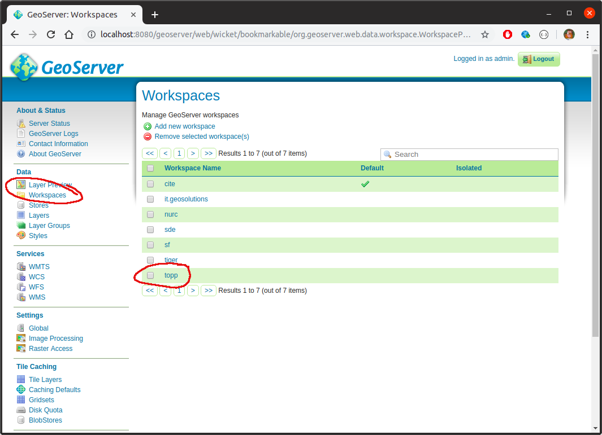
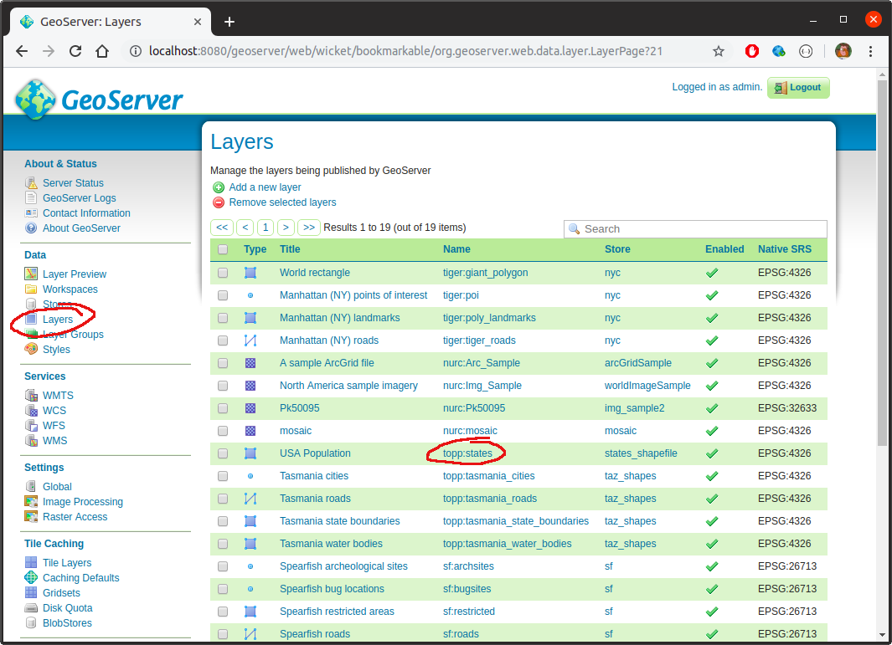
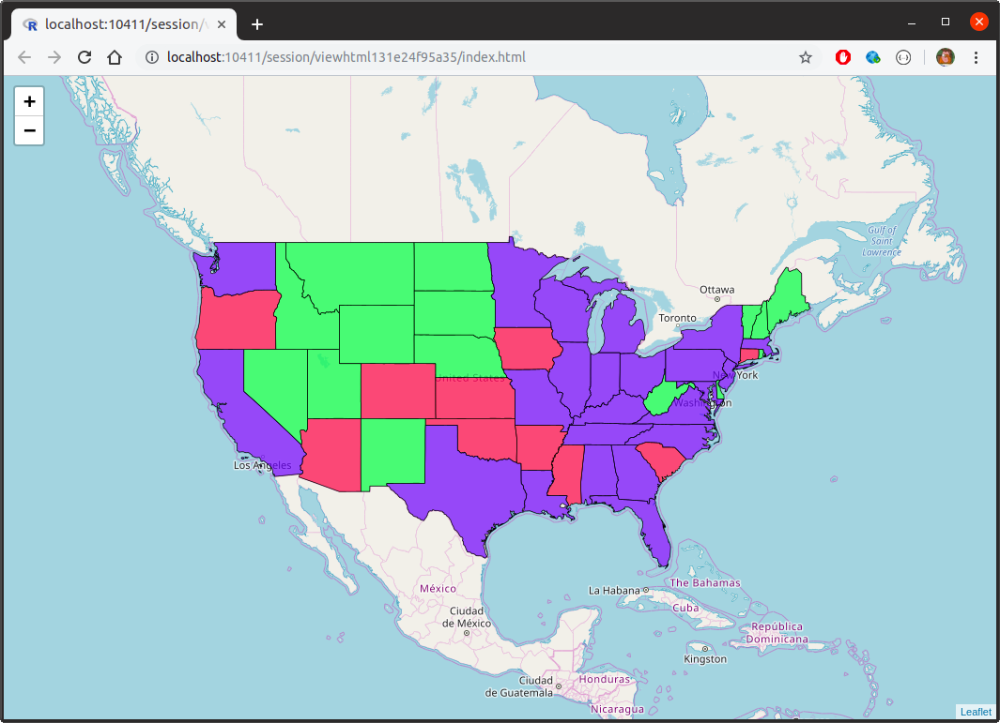
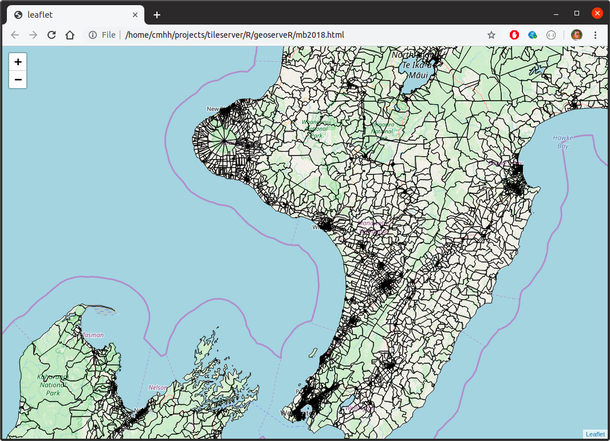
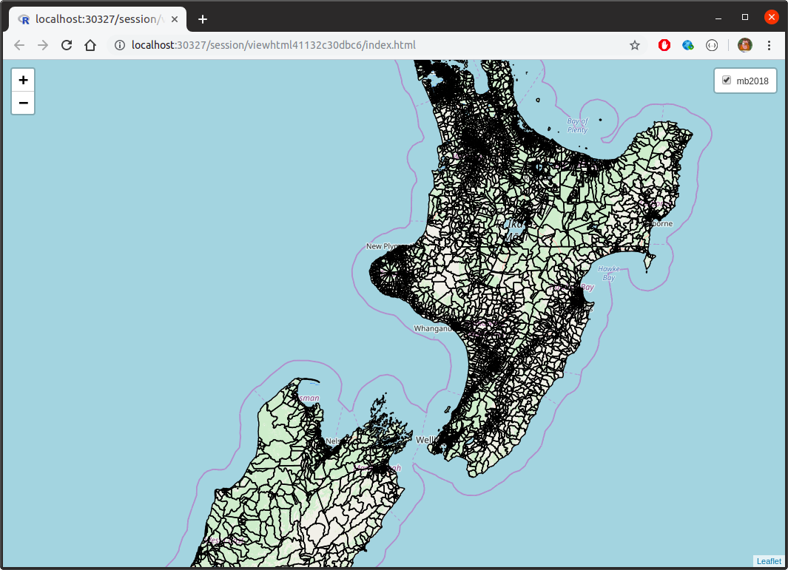
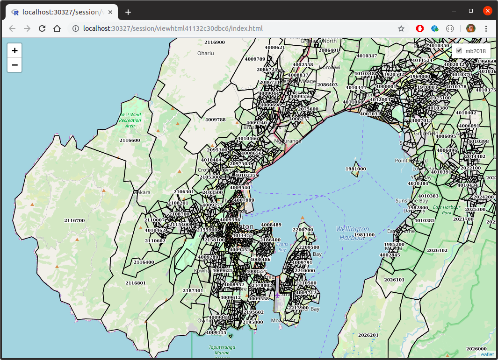
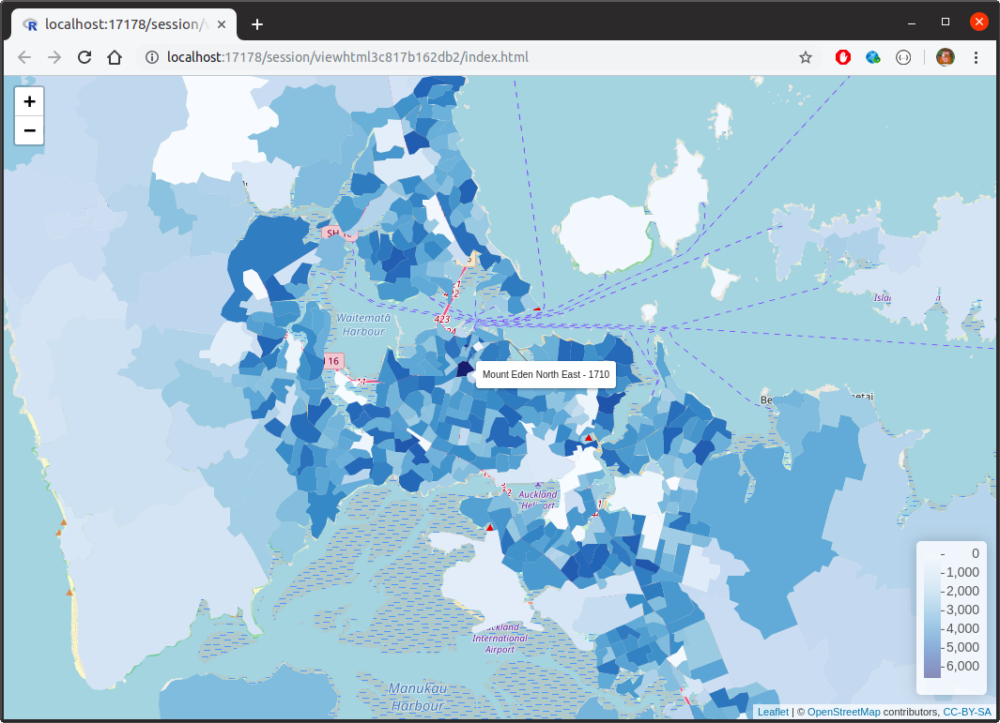
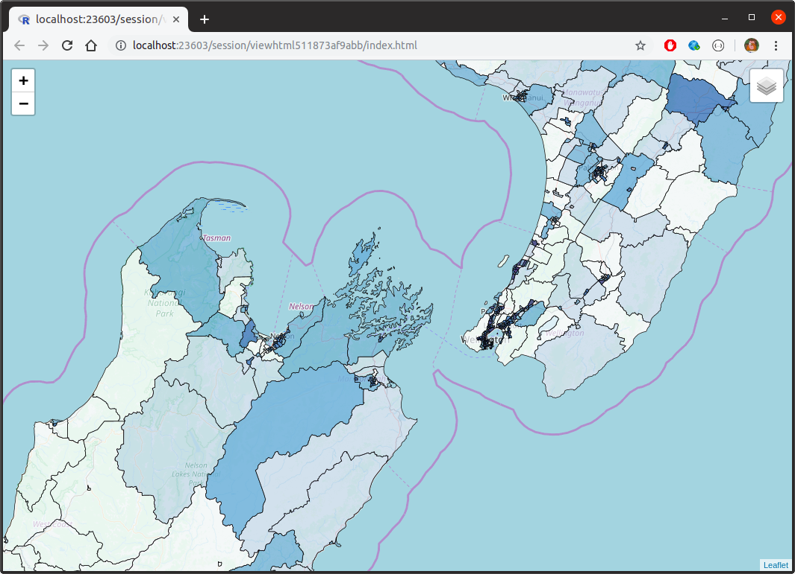
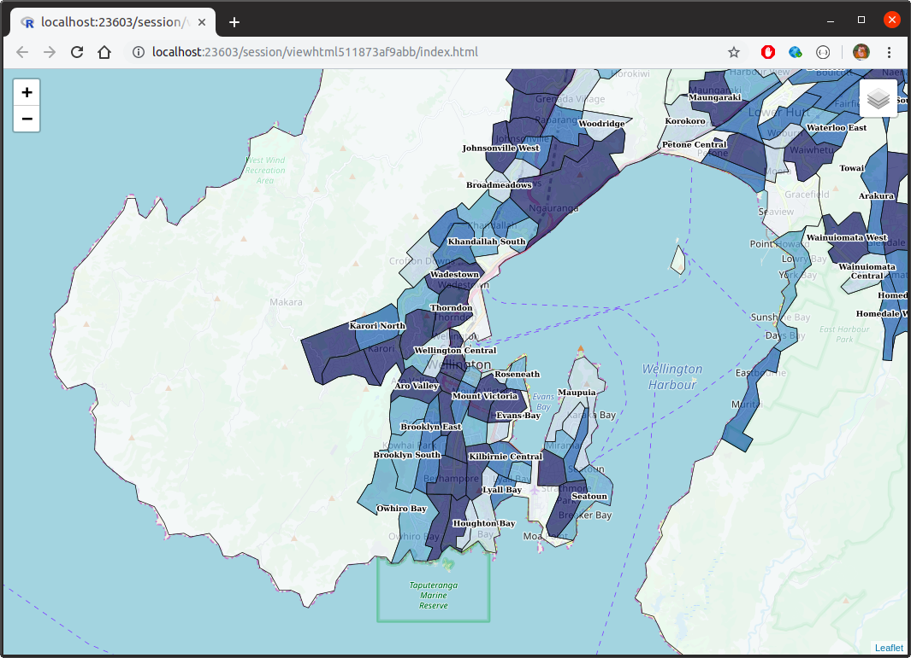

<!--
move all curl calls into an appendix?  have R, then curl in appendix.  
R only in main doc.
-->

# Building tile services on-the-fly with GeoServer

## Overview

Interactive web applications can be a great way to present information to a diverse audience.  If your interface is well designed and intuitive, then almost anybody will be able to use it.  And where data has a spatial dimension, slippy maps can be an effective way of presenting information.  But sometimes the objects we want to render are a bit on the large side.  This means that our web browser can struggle to render all the required features, and it also means that mobile users of an app might end up using excessive amounts of data.

A good solution to the problem, that the spatial features we need to display are large, is to use some sort of tile service.  Slippy maps can, for the most part, fetch information from a tile service only for the active extent.  So, here we look at using [GeoServer](https://geoserver.org) as a means of publishing such services.  We put special emphasis on ease of use and deployment, so cover the following:

* the use of Docker to simplify the installation and deployment of GeoServer itself
* the use of GeoServer's REST API 
* wrapping calls to GeoServer's REST API to simplify a number of common use cases

Specifically, we'll demonstrate how we can create new tile services on-the-fly entirely within R (though we could use any language capable of making HTTP calls and manipulating geospatial data&ndash;Python with geopandas, for example).


## A comment on spatial formats

In this overview we work exclusively with GeoPackages.  Of course shapefile is somewhat ubiquitous&ndash;it's readily available, and most GIS tools can work with it easily.  But shapefile is a proprietary format with a lot of very real drawbacks.  GeoPackage, on the other hand, is an open format built on SQLite which has few, if any, of the same drawbacks, and is widely supported in mainstream GIS tools.  

Converting shapefile to GeoPackage is relatively easy if you have access to [GDAL](https://gdal.org/):

```bash
$ ogr2ogr -f GPKG output.gpkg input.shp
```


## Source data

Throughout this document, we use spatial features sourced from 
[Stats NZ geographic data service](https://datafinder.stats.govt.nz).  Specifically:

* [Meshblock 2018 Clipped (generalised)](https://datafinder.stats.govt.nz/layer/92198-meshblock-2018-clipped-generalised/)
* [Statistical Area 1 2018 (genaralised)](https://datafinder.stats.govt.nz/layer/92211-statistical-area-1-2018-clipped-generalised/)
* [Statistical Area 2 2018 (generalised)](https://datafinder.stats.govt.nz/layer/92213-statistical-area-2-2018-clipped-generalised/)
* [Territorial Authority 2018 Clipped (generalised)](https://datafinder.stats.govt.nz/layer/92215-territorial-authority-2018-clipped-generalised/)
* [Regional Council 2018 Clipped (generalised)](https://datafinder.stats.govt.nz/layer/92205-regional-council-2018-clipped-generalised/)

In addition, we also combine this with contextual information found on [NZ.Stat](http://nzdotstat.stats.govt.nz/wbos/Index.aspx?_ga=2.229484444.1460045830.1566778650-200579101.1566001142):

* [Subnational population estimates (RC, SA2), by age and sex, at 30 June 1996, 2001, 2006-18 (2018 boundaries)](http://nzdotstat.stats.govt.nz/wbos/Index.aspx?DataSetCode=TABLECODE7979)
* [Subnational population estimates (TA, SA2), by age and sex, at 30 June 1996, 2001, 2006-18 (2018 boundaries)](http://nzdotstat.stats.govt.nz/wbos/Index.aspx?DataSetCode=TABLECODE7980)


## Installation

To install the R package used throughout this document, simply run:

```r
devtools::install_github("cmhh/geoserveR")
```

The R package requires a running instance of GeoServer to be useful.  We can get GeoServer up and running easily using Docker.  There is [no shortage of existing images online](https://wiki.osgeo.org/wiki/DockerImages), but we'll build our own.  We do this because it's pretty straight forward, and because it's instructive.  The R package contains a Dockerfile in `docker/Dockerfile` as follows:

```dockerfile
FROM ubuntu:18.04

ENV DEBIAN_FRONTEND noninteractive

ENV GEOSERVER_VERSION 2.15.2

RUN apt-get update && \
  apt-get install -y \
    ca-certificates openssl wget openjdk-8-jre \
    openssh-server openssh-client unzip && \
  apt-get clean && \
  update-ca-certificates && \
  cd /usr/local && \
  wget http://sourceforge.net/projects/geoserver/files/GeoServer/${GEOSERVER_VERSION}/geoserver-${GEOSERVER_VERSION}-bin.zip && \
  unzip geoserver-${GEOSERVER_VERSION}-bin.zip && \
  mv geoserver-${GEOSERVER_VERSION} geoserver && \
  rm geoserver-${GEOSERVER_VERSION}-bin.zip

ENV GEOSERVER_HOME /usr/local/geoserver

ENV GEOSERVER_DATA_DIR ${GEOSERVER_HOME}/data_dir

EXPOSE 8080

CMD ["sh", "/usr/local/geoserver/bin/startup.sh"]
```

The R package can be used to generate the command required to build the image since the location of `Dockerfile` will vary depending on the user's setup.  For example:

```r
> geoserveR::docker_build(tag = 'geoserver')
docker build -t geoserver "/home/cmhh/R/x86_64-pc-linux-gnu-library/3.5/geoserveR/docker"
```

Running the resulting command at the terminal will result in the creation of an image called, in this case, `geoserver`.  We can start this via:

```bash
$ docker run -d --name geoserver --rm -p 8080:8080 geoserver
```

The container will take a short while to get up and running completely, but when done, simply open a browser at `http://localhost:8080/geoserver`.  To login, the username is `admin`, and the password is `geoserver` (obviously, we'd configure this differently in a production setting... more on that later).  And that's it.


## Testing GeoServer

GeoServer includes several data sources by default, and we can use these to test out our install.  We're mostly interested in WMS services which we can display on a leaflet map, though GeoServer can display WCS, WFS, WMS, and WMTS. 

Broadly speaking, GeoServer groups sets of _layers_ together in _workspaces_, where the layers are the features we're intrested in displaying on a map.  And the layers themselves are built up from _data stores_.  We can inspect workspaces in the main web interface by clicking the Data > Workpaces link:



Any of the listed workspaces can then be accessed as WMS services programmatically via `http://localhost/geoserver/<workspace>/wms?` (and an XML file describing the service can be accessed via `http://localhost/geoserver/<workspace>/wms?request=GetCapabilities`).  For example, if we wanted to display layers that are part of the `topp` workspace, we'd use `http://localhost:8080/geoserver/topp/wms?`.  If we click on Data > Layers in the main web interface we see that there is, for example, a layer in the `topp` workspace called `states`:



We can display this in a leaflet map in R by running the following code:

```r
library(leaflet)

leaflet() %>%
  addTiles(
    urlTemplate = "https://{s}.tile.openstreetmap.org/{z}/{x}/{y}.png"
  ) %>%
  leaflet::fitBounds(-125, 25, -67, 50) %>%
  addWMSTiles(
    "http://localhost:8080/geoserver/topp/wms?", 
    layers = "states",
    options = WMSTileOptions(format = "image/png", transparent = TRUE)
  )
```

which yields the following:




## An R client library

Our use case is to create styled tiles services, entirely from within R.  To simplify the discussion, a simple R package is provided which:

* includes geographies (as `sf` objects)
* includes population counts (as a tidy `data.frame`)
* includes an interface for (a subset of) the GeoServer REST API
* includes utilities that simplify working with the GeoServer interface.

We won't go into the details here, but rather just describe the relevant usage as it arises.  Where possible, though, we will also consider the plain HTTP calls.  But by way of example, the following lists the layers available in the `topp` workspace.  First, using the REST API (via `curl`):

```bash
$ curl -s -u admin:geoserver -X GET \
    http://localhost:8080/geoserver/rest/workspaces/topp/layers | jq '.'
```
```json
{
  "layers": {
    "layer": [
      {
        "name": "states",
        "href": "http://localhost:8080/geoserver/rest/workspaces/topp/layers/states.json"
      },
      {
        "name": "tasmania_cities",
        "href": "http://localhost:8080/geoserver/rest/workspaces/topp/layers/tasmania_cities.json"
      },
      {
        "name": "tasmania_roads",
        "href": "http://localhost:8080/geoserver/rest/workspaces/topp/layers/tasmania_roads.json"
      },
      {
        "name": "tasmania_state_boundaries",
        "href": "http://localhost:8080/geoserver/rest/workspaces/topp/layers/tasmania_state_boundaries.json"
      },
      {
        "name": "tasmania_water_bodies",
        "href": "http://localhost:8080/geoserver/rest/workspaces/topp/layers/tasmania_water_bodies.json"
      }
    ]
  }
}
```

and then using the provided R package:

```r
> library(geoserveR)
> gs <- GeoServer$new()
> topp_layers <- gs$getLayers("topp")
> str(topp_layers)
List of 5
 $ states                   :List of 2
  ..$ name: chr "states"
  ..$ href: chr "http://localhost:8080/geoserver/rest/workspaces/topp/layers/states.json"
 $ tasmania_cities          :List of 2
  ..$ name: chr "tasmania_cities"
  ..$ href: chr "http://localhost:8080/geoserver/rest/workspaces/topp/layers/tasmania_cities.json"
 $ tasmania_roads           :List of 2
  ..$ name: chr "tasmania_roads"
  ..$ href: chr "http://localhost:8080/geoserver/rest/workspaces/topp/layers/tasmania_roads.json"
 $ tasmania_state_boundaries:List of 2
  ..$ name: chr "tasmania_state_boundaries"
  ..$ href: chr "http://localhost:8080/geoserver/rest/workspaces/topp/layers/tasmania_state_boundaries.json"
 $ tasmania_water_bodies    :List of 2
  ..$ name: chr "tasmania_water_bodies"
  ..$ href: chr "http://localhost:8080/geoserver/rest/workspaces/topp/layers/tasmania_water_bodies.json"
```

## Making a new layer

Pretty much any layer that exists in GeoServer can be made available as a service&ndash;WMS in our case.  We'll run through a couple of examples, but, broadly speaking, the steps are:

* create a _workspace_
* add a _datastore_ to the workspace
* add a _style_ via a styled layer descriptor (sld) file
* add a _layer_ to the workspace which references the data store and style

We'll put all our examples in a single workspace named `statsnz`.  We can create this in R as follows:

```r
library(geserveR)

gs <- GeoServer$new()
gs$createWorkspace("statsnz")
```

## Example - meshblock with labels

Meshblocks are the building blocks of most other official geographies held by Stats NZ.  There are approximately 50,000 of them and collectively they are quite large&ndash;the GeoPackage used here was 91MB, though we simplified this considerably using [mapshaper](https://mapshaper.org/) to make things practical.  To display them in R on a leaflet map:

```r
library(geoserveR)
library(leaflet)

leaflet() %>%
  addTiles(urlTemplate = "https://{s}.tile.openstreetmap.org/{z}/{x}/{y}.png") %>%
  addPolygons(data = mb2018, 
              color = "#000000", weight = 1, opacity = 1, fillOpacity = 0,
              label = ~code)
```

This yields something like the following:



Saved as a stand-alone HTML file, this weighs in at over 15MB, and can be sluggish when rendering.  In actuality, the features are oversimplified here, so that when zoomed in the shapes have lost far too much detail.  But if we'd displayed them at full resolution, our HTML file would be over 100MB!

To make meshblocks available as a service, we first add a datastore.  We can add this in R as follows:

```r
gs$createDatastore(mb2018, "statsnz", "mb2018")
```

Internally, this creates a copy of the `mb2018` feature class as a GeoPackage, and then uploads it to the server via the `datastores` endpoint.  We then make a layer in R as follows:

```r
style <- import_template(
  "outline_with_label",
  name = "mb2018_with_labels", strokeColor = "#000000", strokeWidth = 1,
  maxScale = 600000, geometryName = "geom", labelName = "code",
  fontFamily = "Arial", fontSize = 9, fontStyle = "normal",
  fontWeight = "bold", fontColor = "#000000",
  haloSize = 1.5, haloColor = "#FFFFFF"
)

gs$createLayer("statsnz", "mb2018", "mb2018_with_labels", style)
```

Internally, we create a _feature type_, which is initially unconfigured.  We then create a new style, and then we apply the style to the created layer.  The variable `style` contains styling information in styled layer descriptor (SLD) format.  The approach here isn't terribly refined, but it is practical.  The `import_template` function is used to import bundled templates, and replace placeholders with parameter values.  

Either way, having done all this, we can now access meshblocks as a WMS via `http://localhost:8080/statsnz/wms?` as follows:

```r
leaflet() %>%
  fitBounds(lng1 = 164.45, lng2 = 179.35, lat1 = -48.52, lat2 = -33.22) %>%
  addTiles(
    urlTemplate = "https://{s}.tile.openstreetmap.org/{z}/{x}/{y}.png"
  ) %>%
  addWMSTiles(
    "http://localhost:8080/geoserver/statsnz/wms?", 
    layers = "mb2018_with_labels",
    options = WMSTileOptions(format = "image/png", transparent = TRUE), 
    group = "mb2018"
  ) %>%
  addLayersControl(
    overlayGroups = "mb2018",
    options = layersControlOptions(collapsed = FALSE)
  )
```

Visually:





Better yet, saved as a stand-alone HTML file, this map is less than 500KB (though the various tiles still need to be transferred, so one can still burn through a bit of data just navigating around).


## Example - population by statistical area 2

Consider the following R code:

```r
library(geoserveR)
library(leaflet)
library(sf)
library(dplyr)

data(sa22018)
data(popdata)

mapdata <- sa22018 %>%
  inner_join(filter(popdata, geography == "sa22018"), by = "code") %>%
  filter(year == 2018)

pal <- colorNumeric(palette = "Blues", domain = mapdata$value)

leaflet() %>%
  addTiles(urlTemplate = "https://{s}.tile.openstreetmap.org/{z}/{x}/{y}.png") %>%
  addPolygons(data = mapdata, 
              fillColor = ~pal(value), opacity = 0, fillOpacity = 1,
              label = ~sprintf("%s - %s", label, value)) %>%
  addLegend(position = "bottomright", pal = pal, values = mapdata$value)
```

This yields an interactive map as follows:



The resulting HTML file weighs in at 3.2MB&ndash;not enormous by any stretch, but still probably not something you want users to be fetching repeatedly over a mobile connection, for example.  But this map just shows data for 2018, yet we have data for the years 1996, 2001, and 2006-2018&ndash;that's 15 years all up.  What if we want to make all this available on one map?  In that case, the resulting stand-alone HTML file weighs in at over 40MB.  (Of course, a hosted app could serve up a year based on user selection, but 3MB or so would still be transferred each time the year was switched).

Let us instead see if we can create a workspace in GeoServer which contains a layer for each year.  As a WMS, the layers will cease to be interactive (so no hovering tooltips), but we could at least render a label whenever the user zooms in close enough, so let's do that too.

First, we create a version of the SA2 feature class that has population counts:

```r
library(dplyr)
library(reshape2)

counts <- popdata %>%
  dplyr::filter(geography == "sa22018") %>%
  dplyr::select(-geography)

counts_wide <- counts %>%
  reshape2::dcast(code ~ year, value.var = "value") %>%
  data.frame # this is deliberate so years are like X1996 rather than `1996`

sa22018_with_counts <- sa22018 %>%
  inner_join(counts_wide, by = "code")
```

Then, we create a data store using the feature class created, and add a new layer for each of the columns:

```r
gs <- GeoServer$new()

gs$createDatastore(sa22018_with_counts, "statsnz", "sa22018_with_counts")

years <- c(1996, 2001, 2006:2018)

for (year in years) {
  col <- sprintf("X%s", year)
  name <- sprintf("sa22018_%s", year)
  style <- create_polygon_fills(sa22018_with_counts, col, "geom", "label")
  gs$createLayer("statsnz", "sa22018_with_counts", name, style) 
}
```

And that's it&mdash;we now have a bunch of new layers called `sa22018_1996`, and so on.  There's a little bit going on under the hood, of course, but either way we can now use the resulting WMS layers as follows:

```r
m <- leaflet() %>%
  fitBounds(lng1 = 164.45, lng2 = 179.35, lat1 = -48.52, lat2 = -33.22) %>%
  addTiles(
    urlTemplate = "https://{s}.tile.openstreetmap.org/{z}/{x}/{y}.png"
  )

for (year in years) {
  m <- m %>%
    addWMSTiles(
      "http://localhost:8080/geoserver/statsnz/wms?",
      layers = sprintf("sa22018_%s", year),
      options = WMSTileOptions(format = "image/png", transparent = TRUE),
      group = as.character(year)
    ) %>%
    hideGroup(as.character(year))
}

m %>%
  addLayersControl(
    overlayGroups = as.character(years),
    options = layersControlOptions(collapsed = TRUE)
  ) %>%
  showGroup(as.character(tail(years, 1)))
```

which yields:






<!--
## Extension&ndash;adding PostGIS to our Docker image

Throughout the demo we just used shapefiles.  Shapefiles are useful in the sense that 
-->


## Appendix - API calls

For the sake of brevity, the examples above mostly focused on R calls using the provided R client library.  For the sake of completeness, and for those who might want to do something similar without R, we include the equivalent functionality using direct API calls.

### Creating a workspace

To make the `statsnz` workspace, we ran:

```r
library(geserveR)

gs <- GeoServer$new()
gs$createWorkspace("statsnz")
```

To do this direclty, we use the `workspaces` endpoint:

```bash
curl \
  -u admin:geoserver \
  -H "Content-Type: application/json" \
  -d '{"workspace":{"name":"statsnz"}}' \
  -X POST \
  http://localhost:8080/geoserver/rest/workspaces
```

### Creating a datastore

To add the meshblock feature set as a datastore, we ran the following in R:

```r
gs$createDatastore(mb2018, "statsnz", "mb2018", "mb2018.gpkg")
```

Internally, this results in `mb2018` first being saved as a temporary GeoPackage, before being uploaded via the `datastores` endpoint.  If we wanted to do this manually, we'd first create the GeoPackage in R:

```r
fname <- tempfile(fileext = ".gpkg")
st_write(regc2018, fname, "mb2018")
```

and then we'd `PUT` via the `datastores` endpoint as follows (assuming `fname` has the value `file4b82655cefdd.gpkg`):

```bash
curl \
  -u admin:geoserver \
  -H "Accept: application/json, text/xml, application/xml, */*" \
  -H "Content-Type: application/octet-stream" \
  -T "/tmp/RtmpbY5Tby/file4b82655cefdd.gpkg" \
  -X PUT \
  "http://localhost:8080/geoserver/rest/workspaces/statsnz/datastores/regc2018/file.gpkg?configure=none&update=overwrite&charset=UTF-8&filename=mb2018.gpkg"
```

### Creating a layer

To create a meshblock layer with a simple outline and text label, we ran the following in R:

```r
style <- import_template(
  "outline_with_label",
  name = "mb2018_with_labels", strokeColor = "#000000", strokeWidth = 1,
  maxScale = 600000, geometryName = "geom", labelName = "code",
  fontFamily = "Arial", fontSize = 9, fontStyle = "normal",
  fontWeight = "bold", fontColor = "#000000",
  haloSize = 1.5, haloColor = "#FFFFFF"
)

gs$createLayer("statsnz", "mb2018", "mb2018_with_labels", style)
```

Assuming we have saved the content of the variable `style` in a file called `style.sld`, we could create the style on the server as follows:

```bash
curl \
  -u admin:geoserver \
  -H "Accept: application/json, text/xml, application/xml, */*" \
  -H "Content-Type: application/vnd.ogc.sld+xml" \
  --data "@style.sld" \
  -X POST \
  "http://localhost:8080/geoserver/rest/workspaces/statsnz/styles?name=mb2018_with_label"
```

We'd create the feature type as:

```bash
curl \
  -u admin:geoserver \
  -H "Content-Type: application/json" \
  -d '{"featureType":{"name":"mb2018_with_labels", "nativeName":"mb2018"}}' \
  -X POST \
  "http://localhost:8080/geoserver/rest/workspaces/statsnz/datastores/mb2018/featuretypes"
```

and we'd add the style to the layer as:

```bash
curl \
  -u admin:geoserver \
  -H "Content-Type: application/json" \
  -d '{"layer":{"defaultStyle":{"name":"statsnz:labelledpolygon"}}}' \
  -X PUT \
  "http://localhost:8080/geoserver/rest/workspaces/statsnz/layers/mb2018"
```